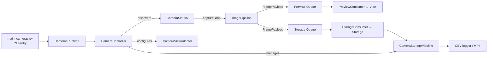

# Cameras Module Architecture

## Purpose
This document captures the current structure of the Cameras stub runtime, highlights the core flows (capture → preview → storage/UI), and proposes a logical directory/docs layout ahead of the refactor requested by the logger team.

## Core Responsibilities
- **Module entry (`app/main_cameras.py`)**: parses CLI flags exposed by the module manager, bootstraps the StubCodex supervisor, and hands control to `CamerasRuntime`.
- **Runtime adapter (`app/camera_runtime.py`)**: thin bridge that wires supervisor callbacks (start/shutdown/commands) into the controller layer.
- **Controller layer (`controller/*`)**: `CameraController` orchestrates hardware discovery, preview grid wiring, frame routing, storage toggles, and user/command handling. `CameraSlot` encapsulates per-camera state, while `PreviewConsumer` (in `ui/`) and `StorageConsumer` (in `storage/`) drain queues and talk to the view or storage pipeline. View-specific wiring lives in `controller/view_manager.py`, the recording/session lifecycle is isolated in `controller/storage_manager.py`, and `controller/camera_setup.py` owns camera discovery + slot teardown so the runtime class focuses on orchestration.
- **Domain (`domain/model`, `domain/pipelines`)**: `CameraModel` owns persisted preferences, IO thresholds, and output/session directories. `ImagePipeline` runs the capture loop, frame router, and FPS counters, emitting `FramePayload` objects into preview/storage queues. `FrameTimingTracker` normalizes metadata and detects drops.
- **Storage IO (`io/storage/*`)**: `CameraStoragePipeline` handles CSV logging and MP4 writing (software or hardware path). `CameraCSVLogger` and the local `constants.py` mirror production defaults.
- **Media utilities (`io/media/*`)**: frame conversion helpers, pixel-format normalization, and Pillow/Numpy bridges reused by UI + storage.
- **View (`ui/*`)**: `CameraViewAdapter` maps the stub GUI (Tkinter) into preview canvases, menus, and status HUD updates, abstracting raw Tk widgets away from the controller.

## Runtime Flow


### Key Data Objects
- `CapturedFrame`: raw arrays + metadata straight from Picamera2.
- `FramePayload`: immutable envelope passed between pipeline stages (preview/storage).
- `CameraSlot`: state bundle tying a physical sensor to queues, tasks, FPS counters, and storage handles.

## Observations
- Responsibilities now align with `app/`, `controller/`, `domain/`, `io/`, and `ui/` folders, reducing the 1,000+ line top-level package sprawl.
- Docs that explain how preview throttling, storage gating, and Picamera2 configuration interact are still missing, making onboarding difficult.
- `controller/runtime.py` remains large (~800 LOC) and will need further slicing (sensor config helpers, preview controls) in a follow-up.

## Folder Layout
```
rpi_logger/modules/
  Cameras/
    app/                # CLI entrypoints & runtime adapters (main, runtime)
    controller/         # CameraController, CameraSlot, UI/input handlers
    domain/
      model/            # CameraModel, preferences, runtime state
      pipelines/        # ImagePipeline, FrameGate, FrameTimingTracker
    io/
      storage/          # CameraStoragePipeline, csv logger, constants
      media/            # frame & color conversion utilities
    ui/                 # View adapters, GUI assets, layout helpers
    docs/
      architecture.md   # high-level doc (this file once relocated)
      pipelines.md      # capture/preview/storage deep dive
      operations.md     # start/stop flows, CLI flag matrix
      config.md         # persisted preferences & overlay config
    tests/
      ...               # focused unit/integration tests per area
```
(If the production camera core stays vendored, keep it under `camera_core/` and treat `domain/` as the shim layer that adapts to Picamera2.)

### Next Steps
1. **Docs**: Flesh out `docs/pipelines.md` (capture/preview/storage), `docs/storage.md` (CSV schema, MP4 naming), and `docs/ui.md` (Tk bindings, actions menu) so new contributors can navigate the layers.
2. **Pipeline cleanup**: Consider splitting `ImagePipeline` into capture/router primitives and relocate timing helpers beside them for even clearer ownership.
3. **Controller slimming**: Extract preview layout, recording toggles, and Picamera2 configuration helpers into dedicated modules to shrink `controller/runtime.py`.
4. **Tests & linting**: Backfill unit tests for `io/storage`, `io/media`, and the frame gating logic to lock in behavior before further optimization.

### Documentation Matrix Proposal
| Doc | Purpose | Owners |
| --- | --- | --- |
| `docs/architecture.md` | High-level overview, data flow diagram, glossary | Module maintainers |
| `docs/pipelines.md` | Detailed capture → preview → storage sequencing, queue tuning, FPS gates | Camera/runtime engineers |
| `docs/config.md` | CLI flags ↔ config.txt keys, persistence rules | Logger platform team |
| `docs/ui.md` | View adapter layout, Tk bindings, actions menu | UX/dev tooling |
| `docs/storage.md` | CSV schema, MP4 naming, hardware vs software encoding | Data ingest team |

This structure keeps hardware-centric concerns (`io/`), GUI (`ui/`), logic (`controller/`, `domain/`), and app bootstrap (`app/`) separate while giving us a single place for living docs that match the code.
