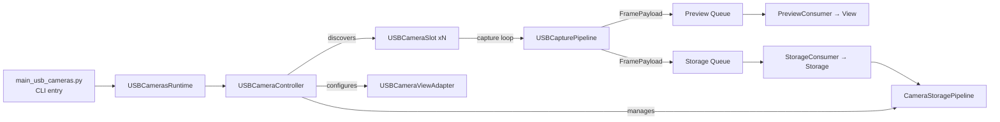

# USB Cameras Module Architecture

## Purpose
USB Cameras is a fresh module that mirrors the existing CSI Cameras module's UX and CLI contract while swapping the hardware layer for OpenCV-backed USB cameras. It keeps the stub (codex) supervisor, preview grid, and storage pipeline behavior so it can be launched by the logger controller just like the CSI module.

## Core Responsibilities
- **App entry (`app/main_usb_cameras.py`)**: CLI surface compatible with the module manager, bootstraps the stub supervisor, and instantiates `USBCamerasRuntime`.
- **Runtime adapter (`app/camera_runtime.py`)**: Forwards supervisor callbacks (start/shutdown/commands) to the controller.
- **Controller (`controller/runtime.py`)**: Orchestrates discovery, delegates to services, wires storage hooks, and owns the task manager/shutdown guard.
- **Services (`services/`)**:
  - `DeviceRegistry` discovers/probes devices, tracks selection, and syncs the UI toggles.
  - `SlotManager` builds/tears down `USBCameraSlot` instances and their pipelines.
  - `RecordingManager` owns trial context and delegates start/stop to storage.
- **Domain (`domain/frame.py`, `domain/state.py`, `domain/pipelines/`)**:
  - `FramePayload`, `CapturedFrame`, `FrameGate`, `RollingFpsCounter` underpin capture/preview/storage routing.
  - `USBCameraModel` computes/persists preferences, derives preview/save cadence, and manages session directories.
  - `USBCapturePipeline` runs the capture loop (OpenCV), handles gating, and routes frames into preview/storage queues.
- **Pipeline (`pipeline/`)**: `PreviewConsumer` feeds the Tk view; `StorageConsumer` pushes frames into the shared storage pipeline; `StorageHooks` defines callbacks.
- **Storage orchestration (`controller/storage_manager.py`)**: Prepares per-camera directories, spins up `CameraStoragePipeline` instances, and toggles recording for all slots.
- **View integration (`controller/view_manager.py` + `ui/adapter.py`)**: Reuses the CSI Cameras Tk adapter to draw the preview grid and IO metrics panel while publishing simplified status strings.
- **IO**:
  - `io/capture/usb_camera.py` wraps `cv2.VideoCapture` with size/FPS hints and device metadata.
  - `io/storage/__init__.py` re-exports the battle-tested CSV/MP4 pipeline from the CSI module.
  - `io/media/__init__.py` re-exports frame conversion helpers.

## Runtime Flow

## Notable Decisions
- **Reuse over reinvention**: Storage, media conversion, and the Tk view adapter are reused from the CSI module to maintain feature parity and reduce risk; USB-specific capture/setup lives in this module.
- **OpenCV-first capture**: `USBCapturePipeline` pulls BGR frames from `cv2.VideoCapture` and wraps them as `FramePayload` objects so downstream consumers remain unchanged.
- **Command parity**: The controller honors the same `start_recording`/`stop_recording` commands emitted by the logger controller, preserving the module-manager contract.

## Next Steps
- Extend discovery to probe friendly USB names (e.g., via `udevadm` or `v4l2-ctl`) when available.
- Backfill tests for `USBCapturePipeline` gating logic and the storage enable/disable lifecycle.
- Add a user-facing settings pane for per-camera resolution/FPS selection once device capabilities are enumerated.
